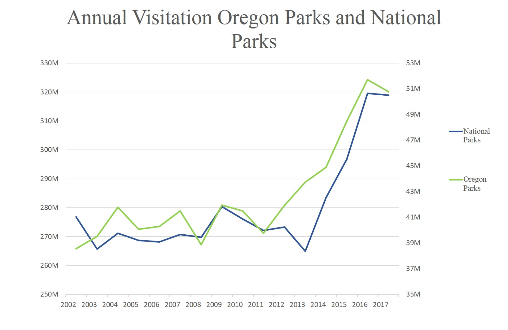

# Oregon State Parks and Social Media Influence
This map will be a illustrate the choice set of the Representative Recreational User and the emerging information set on public lands available through social media platforms that allow users to share and organize their content. The emperical setting for representing this will be Oregon State Parks. 

### Interations
1. Click a Region of Interest
    * Coastal Region
    * Willamette Valley
    * Kalamath Mountains
    * Cascade
    * Eastern Cascades Slopes and Foothills
    * Columbia Plateau
    * Blue Mountains
    * Northern Basin and Range
    * Snake River Plan
2. Within each clicked region, the State parks will be revealed.
3. Clicking on the park icon will reveal the hashtag that has become synonymous with the park.
4. Parks with large engagement will have more information available, i.e. wordclouds and possible photos from Influencer accounts.

## Motivation

### Emerging Visitation Trend
Visitation to parks in the United States have been relatively steady between the late 1990s to early 2000s.  Starting in 2014, these parks experienced consecutive years of record breaking visitation with an average increase of about 10\% each year.

It is clear visitation is on the rise, though it is not uniformly distributed thoughtout each park. Some parks are seeing large spikes while others are fairly stable.  Many journalists have attributed the growing crowds to the ``selfie" and social media photo-sharing apps, especially Instagram. Much of the previous research has focused on how social media data can be used to predict visitation numbers. I intend to examine if social media content (e.g. viral photos) of a given park can explain the shift in demand.

## Economic Theory
### Representative Recreational User

First a recreational user will chose a region to go to that maximizes their utility based on the acitivity they participate in. For example, a surfer will often choose a region that includes beach access. A specific park is then choosen within the region. Previous literature suggest the representative recreational user's utility function depends on the travel cost, individuals preferred activity,  the geographical features, and the given weather conditions when the trip is taken:
	 $$U_i(cost, x, demo, \epsilon)$$
Where $cost$ is the cost of reaching the park, $x$ is a vector of characteristic of each park, $demo$ is a vector of individual characteristics and $\epsilon$ captures unobservables that affect the recreational users decision. These unobservables include the informational cost. Informational cost have been greatly reduced by the proliferation of online user based content which allows individuals to share their experiences at a location. It also reduces the amount of uncertainty an individual recreational user experiences when discovering new locations.

###
